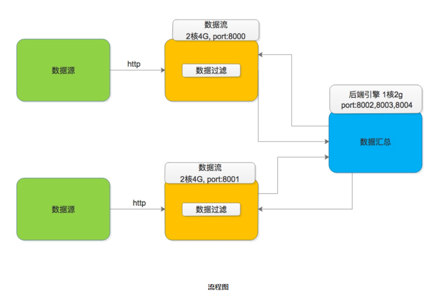

# 实现一个分布式统计和过滤的链路追踪
[官网地址](https://tianchi.aliyun.com/competition/entrance/231790/information)  

## 流程图


## 总结
java实现，71/4404，主要实现了range方式多线程拉取数据，比demo快了10多秒，但是相比排行榜前几还是慢了一个数量级，应该还有一些关键点没有实现。

## 测试
```
mvn clean package  
version=1.0 docker-compose up -d --build
```

## 镜像版本：
registry.cn-hangzhou.aliyuncs.com/odyimage/tail-based-sampling:${version}  
0.1 demo  
0.2 demo优化排序  
0.3 多线程：  
0.3-线程数-总客户端最大缓存数-总服务端最大缓存数  
0.4 增强拼接处代码判定，优化  
0.5 加锁优化 （估计多线程还是没处理好，有概率会miss tracing， 去掉日志出错概率增大？？）  
0.6 加锁基础上优化   
0.7 sleep基础上优化  
0.9 最佳上微调  